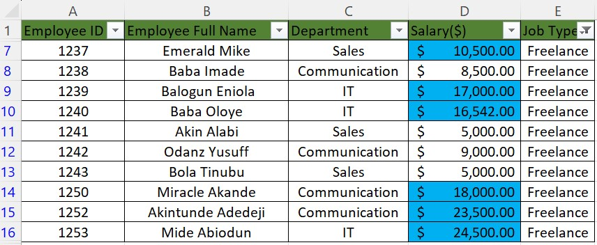
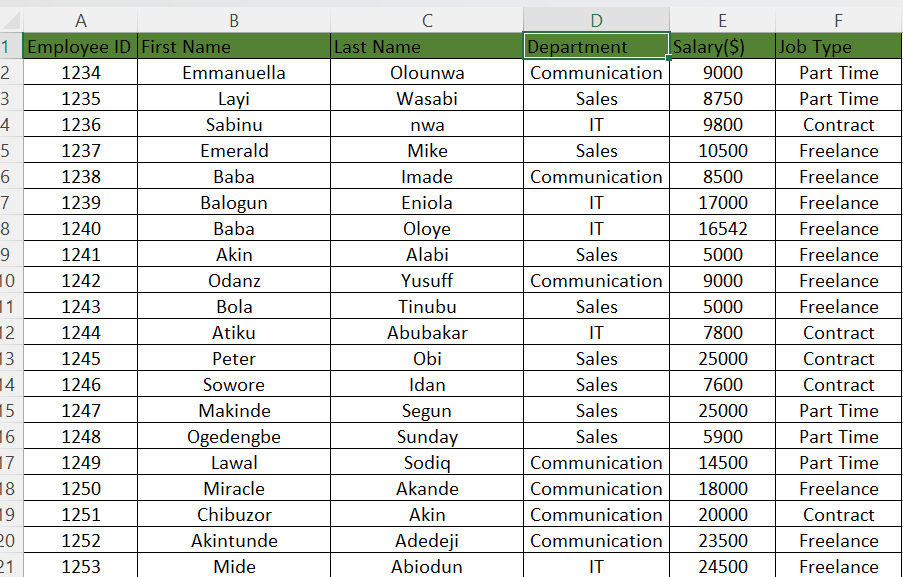
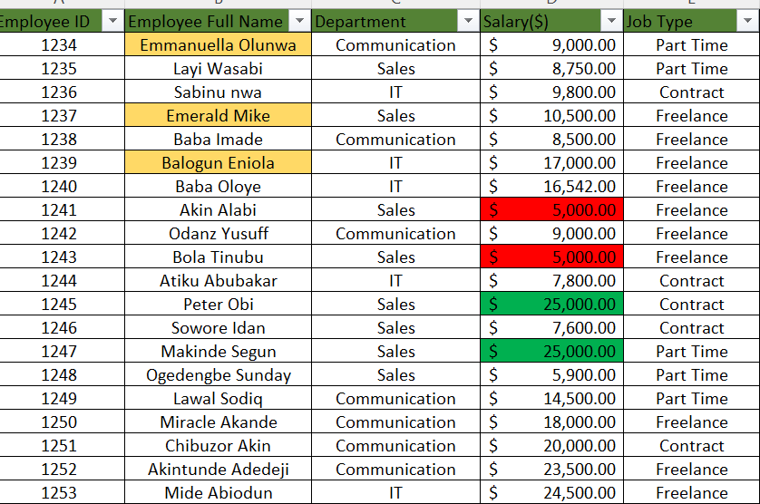

# Data-Analysis-Training-Task-
Introduction to Excel, Week 1

## Introduction
This is a Microsoft Excel task for the beginner, it contains employee information which includes **Employee ID**, **Employee Name**, **Department(Communication, IT, Sales)**, **Salary** ranging from $ 5,000 to $25000,**Job type** (Part-time, freelance and contract). 

**Excel Task 1**

In worksheet 1, I showed employees who are freelancers and also highlighted the ones whose salaries are above $10000

**Excel Task 2**

In worksheet 2, I split the employees' full names into first and last names using the "Text Column" options. I also checked for duplicates but my data doesn't have duplicates in the sheet.

**Excel Task 3**

In worksheet 3, I highlighted the employees whose name begins with the letter "E" and shaded it with yellow color, I formatted the salary column. I shaded the highest salary with green and the lowest salary with red color. 
